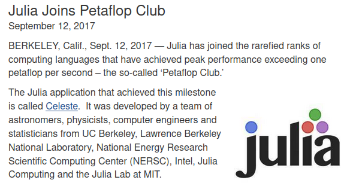

<!-- _paginate: false -->

# Introduction to Julia
### Cédric Simal
cedric.simal@unamur.be
Unamur, Naxys

### CISM Training Sessions
09/11/22

---
<style scoped>
    section {
        text-align: center;
    }
</style>
# Follow along!

https://github.com/csimal/Julia-CISM

---
<style scoped>
    section {
        text-align: center;
        font-size: 30px;
    }
</style>
# Outline

1. Basics of Julia
2. Multiple dispatch
3. Benchmarking Julia code
4. Parallel Programming

---
<style scoped>
    section {
        text-align: center;
        font-size: 30px;
    }
</style>
## Modern Problems in Scientific Computing
### The two languages problem


---
<style scoped>
    section {
        text-align: center;
        font-size: 30px;
    }
</style>
## Modern Problems in Scientific Computing
### The rise of parallel computing

data: https://github.com/karlrupp/microprocessor-trend-data

---
<style scoped>
    section {
        text-align: center;
    }
</style>
# Meet Julia


---
<style scoped>
    section {
        text-align: center;
    }
</style>
# A short history of Julia




https://juliacomputing.com/case-studies/celeste/

---
<style scoped>
    section {
        text-align: center;
        font-size: 30;
    }
</style>
# Why you might want to use Julia
### Julia is fast


https://julialang.org/benchmarks/


---
<style scoped>
    section {
        text-align: center;
    }
</style>
## Why you might want to use Julia
### DifferentialEquations.jl is SOTA


https://benchmarks.sciml.ai/stable/MultiLanguage/ode_wrapper_packages/

---
# Why you might want to use Julia
<style scoped>
    section {
        text-align: center;
        font-size: 30px;
        margin: 30;
    }
</style>

- Open Source (MIT license)
    * It's free to use!
    * Faster development than proprietary languages
- Made for numerical computing
- Unicode
    * Code looks like math
- It's secretly a LISP

---
<style scoped>
    section {
        text-align: center;
        font-size: 30px;
        margin: 30;
    }
</style>
# Why you might *NOT* want to use Julia

- Open Source
    * Documentation can suck
    * Projects with only one maintainer
- Time to first X
    * Parts of your programs have to be recompiled on startup
- Error messages are not beginner-friendly
- Tiny compared to Python
- Array indices start at 1
---
<style scoped>
    section {
        text-align: center;
    }
</style>
# Types


---
# Type System

Julia's type system is
* Dynamic, with optional type annotations `x::Int`
* Parametric `Vector{T}` (*generic types*)
* Hierarchical (subtyping) `Float64 <: Real`

---
# First class citizens

In Julia, the following objects are *first class citizens*
- Functions ($\Rightarrow$ functional programming)
- Types (`Type{T}`)
- Julia Expressions ($\Rightarrow$ Metaprogramming)

---
# Multiple Dispatch
```julia-repl
julia> +
+ (generic function with 198 methods)

julia> methods(+)
# 198 methods for generic function "+":
[1] +(x::Bool, z::Complex{Bool}) in Base at complex.jl:282
[2] +(x::Bool, y::Bool) in Base at bool.jl:96
[3] +(x::Bool) in Base at bool.jl:93
[4] +(x::Bool, y::T) where T<:AbstractFloat in Base at bool.jl:104
[5] +(x::Bool, z::Complex) in Base at complex.jl:289
[6] +(a::Float16, b::Float16) in Base at float.jl:398
[7] +(x::Float32, y::Float32) in Base at float.jl:400
[8] +(x::Float64, y::Float64) in Base at float.jl:401
[9] +(z::Complex{Bool}, x::Bool) in Base at complex.jl:283
[10] +(z::Complex{Bool}, x::Real) in Base at complex.jl:297
...
```
---
<style scoped>
    section {
        text-align: center;
    }
</style>
# The secret sauce behind Julia's speed


---
<style scoped>
    section {
        text-align: center;
    }
</style>

https://github.com/csimal/Julia-CISM
cedric.simal@unamur.be
