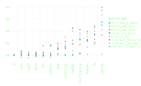

<!-- _paginate: false -->

# Introduction to Julia
### Cédric Simal
Unamur, Naxys
15/12/21


---
# Outline

1. Basics of Julia
2. Multiple dispatch
3. Benchmarking Julia code
4. Parallel Programming

---
<style scoped>
    section {
        text-align: center;
        font-size: 30px;
    }
</style>
# The two languages problem


---
<style scoped>
    section {
        text-align: center;
        font-size: 30px;
    }
</style>
# The rise of parallel computing

data: https://github.com/karlrupp/microprocessor-trend-data

---
<style scoped>
    section {
        text-align: center;
    }
</style>
# Meet Julia


---
<style scoped>
    section {
        text-align: center;
    }
</style>
# A short history of Julia


---
<style scoped>
    section {
        text-align: center;
    }
</style>
# Julia is fast

https://julialang.org/benchmarks/

---
<style scoped>
    section {
        text-align: center;
    }
</style>
# Types


---
# Type System
Julia's type system is
* Dynamic, with optional type annotations `x::Int`
* Parametric `Vector{T}`
* Hierarchical (subtyping) `Float64 <: Real`

---
# Multiple Dispatch
```julia
julia> +
+ (generic function with 198 methods)

julia> methods(+)
# 198 methods for generic function "+":
[1] +(x::Bool, z::Complex{Bool}) in Base at complex.jl:282
[2] +(x::Bool, y::Bool) in Base at bool.jl:96
[3] +(x::Bool) in Base at bool.jl:93
[4] +(x::Bool, y::T) where T<:AbstractFloat in Base at bool.jl:104
[5] +(x::Bool, z::Complex) in Base at complex.jl:289
[6] +(a::Float16, b::Float16) in Base at float.jl:398
[7] +(x::Float32, y::Float32) in Base at float.jl:400
[8] +(x::Float64, y::Float64) in Base at float.jl:401
[9] +(z::Complex{Bool}, x::Bool) in Base at complex.jl:283
[10] +(z::Complex{Bool}, x::Real) in Base at complex.jl:297
...
```
---
<style scoped>
    section {
        text-align: center;
    }
</style>
# The secret sauce behind Julia's speed


---
# Postcard demo

---
# Dynamical Systems

* [DifferentialEquations](https://diffeq.sciml.ai/stable/)
* [DynamicalSystems](https://juliadynamics.github.io/DynamicalSystems.jl/latest/)

---
<style scoped>
    section {
        text-align: center;
    }
</style>


---
# Networks

* [Graphs](https://github.com/JuliaGraphs/Graphs.jl)
* [NetworkDynamics](https://github.com/PIK-ICoNe/NetworkDynamics.jl)
* [SimpleHypergraphs](https://github.com/pszufe/SimpleHypergraphs.jl)
* [Simplicial](https://github.com/nebneuron/Simplicial.jl)


---
# Statistics


---
# Machine Learning


---
# Physics


 [QuantumOptics](https://qojulia.org/)
[Yao](https://github.com/QuantumBFS/Yao.jl)

---
# Astronomy & Aerospace


---
# Optimization


[Optim](https://github.com/JuliaNLSolvers/Optim.jl)
[GalacticOptim](https://github.com/SciML/GalacticOptim.jl)

---
# Interop


---
# Plotting

* [Plots](https://github.com/JuliaPlots/Plots.jl)
* [Gadfly](http://gadflyjl.org/stable/)
* [Makie](http://makie.juliaplots.org/stable/index.html)

---
# Conclusions
* Compared to a year ago, Julia has grown tremendously
* It delivers on its promise to "Walk like Python. Run like C"
* Main challenge: reach critical mass

---
<style scoped>
section {
    text-align: center;
}
</style>
# That's all folks!


https://github.com/csimal/Julia-Unamur